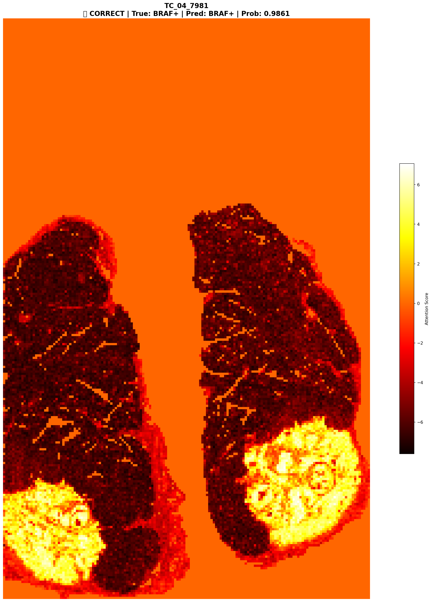

# 🧬 갑상선 BRAF 변이 예측 모델 (Thyroid Mutation Prediction Model)

본 프로젝트는 **갑상선암 병리 슬라이드(WSI)** 이미지를 기반으로
딥러닝을 활용하여 **BRAF 변이 여부를 예측**하는 인공지능 모델을 개발하기 위한 연구이자
디지털 병리 기반 정밀의료 기술 개발의 일환입니다.

## 🔍 연구 배경 및 필요성

BRAF V600E 변이는 갑상선 유두암(Papillary Thyroid Carcinoma, PTC)의 약 80%에서 발견되는
주요 유전적 변화로, 예후, 재발 위험도, 방사성 요오드 치료 반응성 등에 큰 영향을 미칩니다.

그러나 유전자 검사(PCR, NGS 등)는 비용, 시료 제한, 검사 인프라 등의 문제로
모든 환자에게 적용하기 어려운 한계가 있습니다.

따라서 조직학적 형태(H&E 슬라이드)만으로 변이 여부를 추정할 수 있는 AI 모델은
저비용·비침습적 진단을 가능하게 하는 혁신적인 대안이 될 수 있습니다.

| 구분 | 병리의사 | AI 모델 |
| --- | --- | --- |
| **입력 정보** | H&E 병리 슬라이드 | 동일 (WSI 타일) |
| **관찰 단위** | 세포핵, 구조, 색조 | 수백~수천 타일의 픽셀 패턴 |
| **판단 기준** | 경험적 특징 (예: 유두 구조, 핵 모양) | 통계적 특징 벡터 |
| **한계** | 사람 눈으로 보기엔 너무 미세한 차이 | 딥러닝이 고차원 특징에서 구분 가능 |
| **결과** | “BRAF 변이가 의심된다” | “이 슬라이드의 BRAF 확률 = 0.92” (정량화 가능) |

## 🎯 기대 효과

- 비침습적 유전자 예측: 조직 슬라이드만으로 변이 상태 판별 → PCR/NGS 검사 보조 가능
- 검사 효율성 향상: 병리진단 과정 자동화 및 판독시간 단축
- 정밀의료 기반 강화: 예후 예측 및 맞춤 치료 방안 수립에 기여
- 확장성: RAS, RET/NTRK 등 다른 변이 탐지로 모델 확장 가능

---

## 🚀 프로젝트 개요

| 단계 | 설명 |
| --- | --- |
| **1️⃣ 병리 이미지를 입력** | H&E 염색된 조직 슬라이드(WSI)를 AI가 입력으로 받습니다. |
| **2️⃣ 타일 분할** | 슬라이드를 512×512 같은 작은 타일 단위로 나눕니다. |
| **3️⃣ 특징 추출 (Feature Extraction)** | CNN, ViT, CLIP, UNI 등 딥러닝 모델이 타일에서 세포 모양·핵의 크기·조직 구조 등을 벡터(숫자 특징)로 변환합니다. |
| **4️⃣ 학습 (Supervised / Weakly supervised)** | 각 슬라이드가 “BRAF 변이 있음 / 없음”으로 라벨되어 있으면, AI는 그 차이를 만드는 시각적 패턴을 학습합니다. |
| **5️⃣ 예측 및 Heatmap 시각화** | AI가 “이 부위가 BRAF mutation과 관련 있어 보인다”고 판단한 영역을 Heatmap으로 표시합니다. |

이 저장소는 **UNI2-h 비전 트랜스포머(Transformer)** 를 활용한
WSI(Whole Slide Image) 임베딩 파이프라인과,
**ABMIL(Attention-based Multiple Instance Learning)** 기반 BRAF 변이 예측 모델의
전체 전처리 및 학습 코드를 포함합니다.

---

## 📊 데이터 구성

| 구분 | 설명 | 수량 |
| --- | --- | --- |
| Meta (BRAF+) | BRAF 변이 양성 병리 슬라이드 | **862장** |
| Non-meta (BRAF−) | 변이 음성 슬라이드 | **862장** |
| 타일 크기 | 512×512 PNG 패치 | 슬라이드당 평균 약 20,000개 |
| 임베딩 벡터 | 1타일당 1536차원 | UNI2-h 기반 feature vector |

---

## ⚙️ 임베딩 파이프라인

### 🔹 모델 백본
- **UNI2-h (MahmoodLab)**
  - 이미지 크기: 224×224
  - Patch size: 14
  - Embedding dimension: 1536
  - Transformer depth: 24
  - Head 수: 24
  - Activation: SiLU
  - Layer: SwiGLU packed MLP

### 🔹 ABMIL 모델 구조

```
WSI
 └── Tile Embeddings (N × 1536)
        ↓
     Feature Encoder (FC Layer)
        ↓
     Attention Module
        ├── tanh( W_v * v_i + b_v )
        └── sigmoid( W_u * v_i + b_u )
        ↓
     Weighted Aggregation (Σ α_i * v_i)
        ↓
     Classifier (FC → Softmax)
        ↓
     P(BRAF+) or P(BRAF−)
```

- **입력 (Input):** UNI2-h로부터 추출된 타일 임베딩 (N × 1536)
- **Feature Encoder:** FC Layer를 통해 차원 축소 (1536 → 512)
- **Attention Module:** 타일별 중요도 α_i 계산
- **Aggregation:** 가중합(Σ α_i * v_i)으로 슬라이드 대표 벡터 생성
- **Classifier:** Fully Connected + Softmax → BRAF 변이 확률 산출

## 📈 Bag Size별 성능 비교 (WSI Instance-Level)

1700장 규모 (Fold 평균) — v0.5.x 실험 결과

| **Version** | **Bag Size** | **Accuracy (mean ± std)** | **AUC (mean ± std)** | **Sensitivity** | **Specificity** | **PPV** | **NPV** | **F1-score** |
| --- | --- | --- | --- | --- | --- | --- | --- | --- |
| v0.5.0 | 500 | 0.825 ± 0.026 | **0.910 ± 0.022 ⭐ (Best AUC)** | 0.857 ± 0.024 | 0.794 ± 0.064 | 0.810 ± 0.051 | 0.848 ± 0.018 | 0.831 ± 0.021 |
| v0.5.1 | 1000 | 0.8125 ± 0.0195 | 0.9034 ± 0.0151 | 0.8150 ± 0.0599 | 0.8103 ± 0.0604 | 0.8154 ± 0.0466 | 0.8181 ± 0.0411 | 0.8124 ± 0.0226 |
| v0.5.2 | 2000 | 0.8206 ± 0.0255 | 0.9055 ± 0.0237 | 0.8682 ± 0.0486 | 0.7732 ± 0.0876 | 0.7977 ± 0.0557 | 0.8581 ± 0.0363 | 0.8291 ± 0.0184 |
| v0.5.3 | 3000 | 0.8183 ± 0.0240 | 0.9093 ± 0.0219 | 0.8612 ± 0.0298 | 0.7756 ± 0.0573 | 0.7957 ± 0.0410 | 0.8493 ± 0.0230 | 0.8260 ± 0.0203 |
| v0.5.4 | 4000 | 0.8136 ± 0.0265 | 0.9037 ± 0.0206 | 0.8728 ± 0.0458 | 0.7547 ± 0.0815 | 0.7853 ± 0.0491 | 0.8600 ± 0.0367 | 0.8244 ± 0.0199 |
| **v0.5.5** | **5000** | **0.8287 ± 0.0180 ⭐ (Best Accuracy)** | **0.9090 ± 0.0209** | **0.8820 ± 0.0282 ⭐ (Best Sensitivity)** | 0.7755 ± 0.0522 | 0.7983 ± 0.0320 | **0.8693 ± 0.0316** | **0.8376 ± 0.0148 ⭐ (Best F1)** |
| v0.5.6 | 100 | 0.8102 ± 0.0236 | 0.8872 ± 0.0146 | 0.7894 ± 0.0605 | **0.8311 ± 0.0640 ⭐ (Best Specificity)** | 0.8295 ± 0.0568 | 0.8011 ± 0.0377 | 0.8056 ± 0.0262 |
| v0.5.7 | 200 | 0.8090 ± 0.0258 | 0.8964 ± 0.0206 | 0.8240 ± 0.0561 | 0.7940 ± 0.0225 | 0.8000 ± 0.0176 | 0.8217 ± 0.0451 | 0.8109 ± 0.0311 |

## 🧪 example attention map


