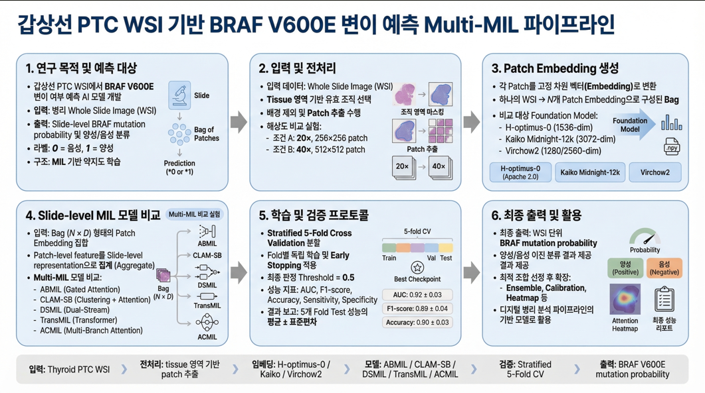

# Thyroid BRAF Mutation Prediction from H&E WSI

<!-- TODO: 개요 파이프라인 Figure 삽입 -->
<p align="center">
  
</p>

---

## Overview

갑상선 유두암(PTC) H&E 병리 슬라이드(WSI)로부터 **BRAF V600E 변이 여부를 예측**하는 딥러닝 파이프라인.

BRAF V600E 변이는 PTC의 약 80%에서 발견되는 주요 드라이버 변이로, 예후 및 치료 반응성에 큰 영향을 미친다. 기존 유전자 검사(PCR, NGS)의 비용과 접근성 한계를 보완하기 위해, **H&E 조직 형태만으로 변이를 추정하는 AI 모델**을 개발하였다.

**핵심 접근법:** Pathology Foundation Model 임베딩 (UNI2-H / H-optimus-0 등) → **Multi-MIL Model Zoo** (ABMIL / CLAM-SB / DSMIL / ACMIL / TransMIL) → 단일모델 5-Fold CV 또는 ABMIL 5-Model Ensemble

---

## Pipeline

```text
H&E WSI
  │
  ▼
Patch Extraction ──────────── 20x 256×256 PNG 타일 분할
  │
  ▼
Foundation Model Embedding ── UNI2-H (ViT-H, 1536-dim) · DDP 4-GPU
  │                           H-optimus-0 (ViT-G, 1536-dim) · DDP 3-GPU
  │                           출력: {slide_id}.npy [N, 1536]
  ▼
MIL Training Branch
  ├─ Single Model (5-Fold CV): abmil | clam_sb | dsmil | acmil | transmil
  └─ Ensemble (ABMIL x5): 고유 양성 700 + 공유 음성 700
  ▼
Evaluation ─────────────────── AUC, Acc, Sens, Spec, F1, PPV, NPV
                               Attention/Heatmap 시각화
```

---

## Project Structure

```
Thyroid_Mutation_model_v2/
├── src/
│   ├── data/                          # 임베딩 추출
│   │   ├── uni2-h/                    # UNI2-H 임베딩 추출 (DDP)
│   │   │   ├── preprocess_data.py
│   │   │   └── run.sh
│   │   ├── h-optimus-0/               # H-optimus-0 임베딩 추출 (DDP)
│   │   │   ├── extract_features.py
│   │   │   └── run.sh
│   │   └── tcga/                      # TCGA-THCA 파이프라인 (외부 검증)
│   │       ├── extract_patches.py     #   SVS → PNG 패치 추출 (20x 256×256, Otsu)
│   │       ├── run_extract_patches.sh
│   │       ├── run_extract_features_hoptimus.sh
│   │       └── run_extract_features_uni2h.sh
│   ├── models/                        # 모델 정의
│   │   ├── abmil/                     # ABMIL (Gated Attention MIL)
│   │   │   └── model.py
│   │   ├── clam_sb/                   # CLAM-SB style MIL
│   │   │   └── model.py
│   │   ├── dsmil/                     # DSMIL
│   │   │   └── model.py
│   │   ├── acmil/                     # ACMIL
│   │   │   └── model.py
│   │   ├── transmil/                  # TransMIL style MIL
│   │   │   └── model.py
│   │   ├── factory.py                 # 모델 생성/레지스트리
│   │   ├── mil_template.py            # MIL 베이스 클래스
│   │   └── layers.py                  # Attention 레이어, MLP 빌더
│   ├── training/                      # 학습
│   │   ├── ensemble/                  # ★ 앙상블 학습 (메인)
│   │   │   ├── main_ensemble.py       #   엔트리포인트
│   │   │   ├── train_ensemble.py      #   5-Model 앙상블 학습 루프
│   │   │   ├── merge_ensemble.py      #   Weight Averaging 병합
│   │   │   └── run_ensemble.sh        #   실행 스크립트
│   │   ├── main.py                    # 단일 모델 학습 엔트리포인트
│   │   ├── train_bag.py               # 5-Fold CV 학습 루프
│   ├── evaluation/                    # 평가 & 시각화
│   │   ├── metric.py                  # 메트릭 계산
│   │   └── visualization.py           # ROC/PR/학습곡선 + Attention Heatmap
│   ├── inference/                     # 추론
│   │   └── inference_pipeline.py      # 추론 파이프라인
│   └── utils/                         # 유틸리티
│       ├── datasets.py                # Bag-level 데이터셋 로더
│       └── cv_splits/                 # K-Fold 분할 JSON
├── configs/
│   └── mil_model_zoo.yaml             # 모델별 preset (abmil/clam_sb/dsmil/acmil/transmil)
├── outputs/                           # 학습 결과 (버전별 체크포인트, 시각화)
└── exports/                           # 내보내기 모델
```

---

## Model Architecture

### Common Input

- 입력: `X = {x_i}_{i=1..N}`, `x_i ∈ R^D` (Foundation Model tile embedding)
  - UNI2-H: D = 1536 / H-optimus-0: D = 1536
- 출력: slide-level binary logits (`BRAF+ / BRAF-`)

### Multi-MIL Model Zoo

| Model | 핵심 아이디어 | 구현 파일 |
|------|--------------|----------|
| `abmil` | Gated attention으로 tile 중요도 학습 후 weighted pooling | `src/models/abmil/model.py` |
| `clam_sb` | Bag branch + max-instance branch 결합 | `src/models/clam_sb/model.py` |
| `dsmil` | Dual-stream (instance + bag) 및 critical instance 기반 집계 | `src/models/dsmil/model.py` |
| `acmil` | Multi-branch attention + stochastic top-k masking | `src/models/acmil/model.py` |
| `transmil` | Transformer encoder로 patch 간 전역 상호작용 학습 | `src/models/transmil/model.py` |

### ABMIL Reference Architecture

```text
Tile Embeddings [N × 1536]   ← UNI2-H features
        │
        ▼
Patch Embedding (FC)         1536 → 512
        │
        ▼
Gated Attention Module
  ├─ tanh(W_v h + b_v)
  └─ sigmoid(W_u h + b_u)
        │
        ▼
Attention Pooling            α_i = softmax(a_i)
Σ α_i · h_i → [1 × 512]
        │
        ▼
Classifier (FC)              512 → 2
        │
        ▼
P(BRAF+) / P(BRAF−)
```

---

## Dataset

| 구분 | 설명 | 수량 |
|------|------|------|
| Meta (BRAF+) | BRAF 변이 양성 슬라이드 | ~2,000 WSI |
| Non-Meta (BRAF−) | 변이 음성 슬라이드 | 862 WSI |
| 슬라이드당 패치 수 | 20x 256×256 타일 | 평균 ~22,000개 |
| 임베딩 차원 | Foundation Model feature vector | 1536-dim |

### Embedding Dataset Versions

| 버전 | Foundation Model | WSI | 배율 | Patch 크기 | 평균 tile 수 |
|------|-----------------|-----|------|-----------|-------------|
| v0.3.0_20x256 | H-optimus-0 | 200 (100+/100−) | 20x | 256×256 | 22,370 |
| v0.4.0_20x256 | H-optimus-0 | 1000 (500+/500−) | 20x | 256×256 | 22,213 |
| **v0.5.0_40x512** | **H-optimus-0** | **4,900 (4,038+/862−)** | **40x** | **512×512** | **~23,000** |
| UNI2-H (ensemble) | UNI2-H | ~1,400 (700+/700−) | 20x | 256×256 | ~22,000 |

---

## Quick Start

### 1. Feature Extraction

**UNI2-H** 임베딩 추출:
```bash
cd src/data/uni2-h && bash run.sh
```

**H-optimus-0** 임베딩 추출:
```bash
cd src/data/h-optimus-0 && bash run.sh
```

### 2. Ensemble Training (Main)

5-Model Ensemble 학습:

```bash
export CUDA_VISIBLE_DEVICES=2

python src/training/ensemble/main_ensemble.py \
    --data_root /path/to/uni2_embeddings \
    --model_save_dir ./outputs/braf_ensemble_vX.X.X \
    --ensemble_json /path/to/ensemble_5models_cv.json \
    --test_json /path/to/test_set.json \
    --epochs 100 --lr 1e-4 --bag_size 5000 --seed 42 \
    --save_model --generate_plots
```

### 3. Single Model Training (5-Fold CV)

```bash
export CUDA_VISIBLE_DEVICES=4

python src/training/main.py \
    --model_name abmil \
    --data_root /path/to/embeddings \
    --model_save_dir ./outputs/Thyroid_prediction_model_vX.X.X \
    --cv_split_file src/utils/cv_splits/cv_splits_xxx.json \
    --epochs 100 --lr 1e-5 --bag_size 3000 --seed 42 \
    --save_model --save_best_only --generate_plots
```

모델은 `--model_name {abmil,clam_sb,dsmil,acmil,transmil}` 중 선택 가능.

예시:

```bash
# CLAM-SB
python src/training/main.py --model_name clam_sb ...

# DSMIL
python src/training/main.py --model_name dsmil ...

# ACMIL
python src/training/main.py --model_name acmil --acmil_num_branches 4 --acmil_topk_ratio 0.1 ...

# TransMIL
python src/training/main.py --model_name transmil --transmil_max_tokens 2048 ...
```

### 4. MLflow 수동 등록 (`thyr-braf`)

`src/training/register_model.py`는 아래 두 가지 방식으로 등록할 수 있다.

```bash
# outputs 기준 최고 성능 모델 자동 선택 (AUC 우선, F1 보조) 후 등록
python src/training/register_model.py \
    --outputs_dir ./outputs \
    --model_filter abmil \
    --compat v1 \
    --alias production

# 특정 checkpoint 직접 지정
python src/training/register_model.py \
    --model_path ./outputs/Thyroid_prediction_model_v0.11.0/checkpoints/best_model_fold5_auc0.9375.pt \
    --compat v1 \
    --alias staging
```

- `--compat v1`: 모델 버전 태그를 `framework=torchscript`, `task=mil` 중심으로 기록
- `--compat v2`: 기존 확장 태그(`embedding`, `model_arch`, `test_*`, `cv_*`)까지 기록

---

## Recent Updates

### 2026-04-24 — TCGA-THCA 외부 검증 추론 완료

- `src/inference/tcga_inference.py` 신규: TCGA 임베딩 → MIL 모델 추론 + MLflow 자동 업로드
  - fold별 개별 결과 출력 (confusion matrix, ROC curve, prob distribution)
  - 패치 수 1,000 미만 슬라이드 자동 필터링 (6개 제외 → 508개 사용)
- H-optimus-0 20x 기반 상위 3개 모델 외부 검증 결과 (TCGA-THCA, 508 WSI):

| 버전 | 모델 | AUC | Acc | F1 | Sensitivity | Specificity | PPV | NPV |
|------|------|-----|-----|----|-------------|-------------|-----|-----|
| v0.13.9 | ABMIL | 0.7939 | 0.7323 | 0.7143 | 0.7234 | 0.7399 | 0.7054 | 0.7566 |
| v0.14.11 | CLAM-SB | **0.8078** | **0.7618** | **0.7604** | **0.8170** | 0.7143 | 0.7111 | **0.8193** |
| v0.16.5 | TransMIL | 0.7928 | 0.7205 | 0.6966 | 0.6936 | **0.7436** | 0.6996 | 0.7382 |

### 2026-04-13 — TCGA-THCA H-optimus-0 20x 임베딩 추출 완료

- TCGA-THCA 514 WSI 임베딩 추출 완료 (H-optimus-0, 20x 256×256)
  - 출력: `/data/dataset/TCGA/TCGA-THCA/embedding/h-optimus-0/20x/` (총 26,629,986 패치)
  - RTX 3080 × 3 (GPU 0,1,5), UUID 지정, batch_size=64
- TCGA-THCA 40x 512×512 패치 추출 완료 (514 WSI, 6,781,950 패치, 소요 90시간)
  - 가장자리 패딩 제거 / alpha=0 필터 / 흑백 배경 제거 개선 적용

### 2026-04-01 — H-optimus-0 40x 512 임베딩 추출 (v0.5.0) + TransMIL 실험

- `src/data/h-optimus-0/run.sh`: 원본 40x 512×512 패치 기반 임베딩 추출로 전환 (v0.5.0_40x512)
  - 패치 소스: `meta_braf_patch_v0.1.0` (4,038 WSI) / `non_meta_braf_patch_v0.1.0` (862 WSI)
  - `CUDA_VISIBLE_DEVICES` UUID 방식으로 V100S 3장 강제 지정
- TransMIL 1000 WSI 실험 (v0.16.x): best AUC 0.8955 (v0.16.5, bag_size=5000)
- MLflow Description 동적 생성: `data_root` 경로에서 임베딩 모델/배율 자동 추론

### 2026-03-30 — TCGA-THCA 외부 검증 파이프라인 추가

- `src/data/tcga/` 신규: TCGA-THCA SVS → 패치 추출 + H-optimus-0 / UNI2-H 임베딩 추출 스크립트
  - `extract_patches.py`: CSV 기반 SVS 일괄 처리, 20x 256×256, Otsu 조직 마스킹, 멀티프로세싱
  - 임베딩 출력 경로: `/data/143/dataset/TCGA/TCGA-THCA/embedding/{h-optimus-0,uni2-h}`

### 2026-03-24 — H-optimus-0 실험 결과 및 Multi-MIL Model Zoo

- ABMIL 경로를 `src/models/abmil/` 패키지로 리팩터링
- MIL SOTA 계열 모델 추가: `clam_sb`, `dsmil`, `acmil`, `transmil`
- `src/models/factory.py` 기반 모델 생성/registry 통합
- 단일 학습 CLI 확장: `--model_name` 및 모델별 override 인자 지원
- H-optimus-0 1000 WSI 실험 결과 추가 (ABMIL best AUC 0.8937, CLAM-SB best AUC 0.8834)
- `src/training/register_model.py`에 outputs 자동 선택 + `--compat {v1,v2}` 등록 모드 추가

---

## Experimental Results

### UNI2-H + ABMIL 5-Model Ensemble

#### Mean(Test) — 5개 모델 평균 성능

| Version | Bag Size | Accuracy | AUC | Sensitivity | Specificity | Precision | NPV | F1 |
|---------|----------|----------|-----|-------------|-------------|-----------|-----|-----|
| v0.1.0 | 500 | 0.8150 | 0.9019 | 0.8780 | 0.7520 | 0.7813 | 0.8626 | 0.8259 |
| v0.1.1 | 1000 | 0.8180 | 0.9002 | 0.8500 | 0.7860 | 0.8004 | 0.8409 | 0.8237 |
| v0.1.2 | 2000 | 0.8210 | 0.8976 | 0.8160 | 0.8260 | 0.8310 | 0.8263 | 0.8174 |
| v0.1.3 | 3000 | 0.8170 | 0.9010 | 0.8560 | 0.7780 | 0.8057 | 0.8509 | 0.8243 |
| v0.1.4 | 4000 | 0.8260 | 0.9056 | 0.8300 | 0.8220 | 0.8303 | 0.8327 | 0.8262 |
| v0.1.5 | 5000 | 0.8330 | 0.9075 | 0.8420 | 0.8240 | 0.8291 | 0.8397 | 0.8347 |

#### Ensemble(Test) — 확률 평균 앙상블 성능

| Version | Bag Size | Accuracy | AUC | Sensitivity | Specificity | Precision | NPV | F1 |
|---------|----------|----------|-----|-------------|-------------|-----------|-----|-----|
| v0.1.0 | 500 | 0.8250 | 0.9173 | 0.8900 | 0.7600 | 0.7876 | 0.8736 | 0.8357 |
| v0.1.1 | 1000 | 0.8400 | 0.9142 | 0.8700 | 0.8100 | 0.8208 | 0.8617 | 0.8447 |
| v0.1.2 | 2000 | 0.8250 | 0.9146 | 0.8500 | 0.8000 | 0.8095 | 0.8421 | 0.8293 |
| v0.1.3 | 3000 | 0.8400 | 0.9171 | 0.9000 | 0.7800 | 0.8036 | 0.8864 | 0.8491 |
| v0.1.4 | 4000 | 0.8400 | 0.9231 | 0.8500 | 0.8300 | 0.8333 | 0.8469 | 0.8416 |
| **v0.1.5** | **5000** | **0.8500** | **0.9232** | **0.8700** | **0.8300** | **0.8365** | **0.8646** | **0.8529** |

- **v0.1.5 (bag_size=5000)**에서 Accuracy, AUC, F1 모두 최고치 기록

---

### H-optimus-0 + MIL Models — 내부 검증 SOTA (단일 모델 5-Fold CV)

> 데이터: v0.4.0_20x256 (1000 WSI, 500+/500−) · H-optimus-0 20x 256×256 · CV split 6:2:2

| 버전 | 모델 | WSI | Bag Size | AUC | Acc | F1 | Sensitivity | Specificity | PPV | NPV |
|------|------|-----|----------|-----|-----|----|-------------|-------------|-----|-----|
| **v0.16.5** | **TransMIL** | 1000 | 5000 | **0.8955** | 0.8200 | 0.8223 | 0.8320 | 0.8080 | 0.8134 | 0.8278 |
| v0.13.9 | ABMIL | 1000 | 3000 | 0.8937 | 0.8180 | 0.8219 | 0.8380 | 0.7980 | 0.8072 | 0.8313 |
| v0.14.11 | CLAM-SB | 1000 | 5000 | 0.8850 | 0.8100 | 0.8089 | 0.8040 | 0.8160 | 0.8153 | 0.8070 |

---

### TCGA-THCA 외부 검증 (External Validation)

> 데이터: TCGA-THCA 508 WSI (BRAF+ 235 / BRAF- 273)  
> 임베딩: H-optimus-0 20x 256×256 · 내부 학습 데이터와 완전히 독립된 외부 코호트

| 버전 | 모델 | AUC | Acc | F1 | Sensitivity | Specificity | PPV | NPV |
|------|------|-----|-----|----|-------------|-------------|-----|-----|
| v0.13.9 | ABMIL | 0.7939 | 0.7323 | 0.7143 | 0.7234 | 0.7399 | 0.7054 | 0.7566 |
| **v0.14.11** | **CLAM-SB** | **0.8078** | **0.7618** | **0.7604** | **0.8170** | 0.7143 | 0.7111 | **0.8193** |
| v0.16.5 | TransMIL | 0.7928 | 0.7205 | 0.6966 | 0.6936 | 0.7436 | 0.6996 | 0.7382 |

- 외부 검증 기준 **CLAM-SB(v0.14.11)** 가 AUC 0.8078로 최고 일반화 성능
- CLAM-SB Sensitivity 0.817로 내부 검증 수준 유지

---

## Requirements

- Python >= 3.8
- PyTorch >= 2.2.0
- timm == 0.9.16
- transformers >= 4.40.0
- openslide-python >= 1.3.1
- scikit-learn, scipy, pandas, numpy
- matplotlib, seaborn
- MLflow

---

## Hardware

| 항목 | 사양 |
|------|------|
| GPU | NVIDIA GeForce RTX 3080 (10GB) × 4, Tesla V100S-PCIE-32GB × 3 |
| CUDA | 12.2 / Driver 535.104.05 |
| UNI2-H 임베딩 추출 | DDP 4-GPU (RTX 3080), batch_size=512 |
| H-optimus-0 임베딩 추출 | DDP 3-GPU (V100S), batch_size=448 |
| 학습 | Single GPU, batch_size=1 (MIL 표준) |
